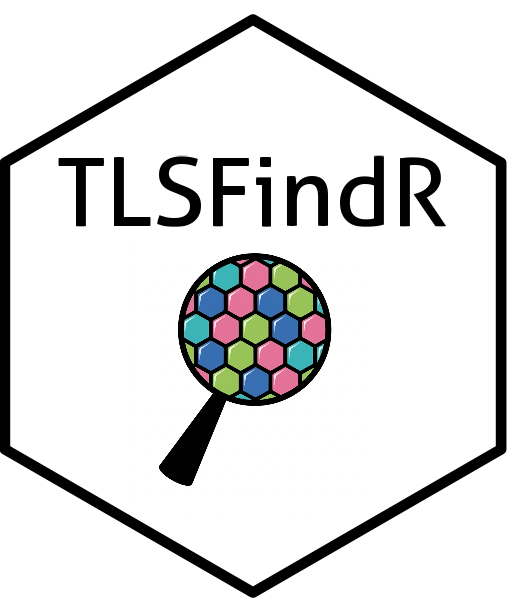
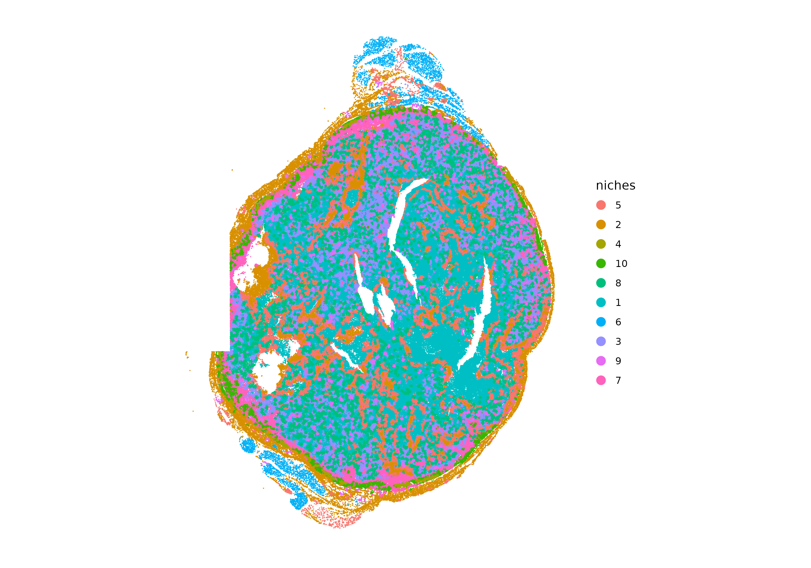
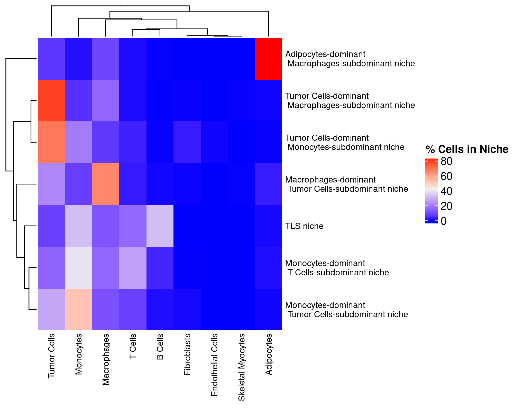
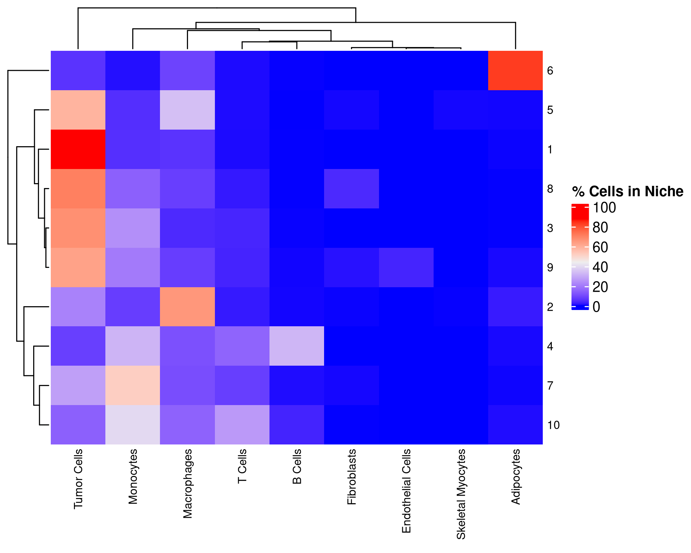
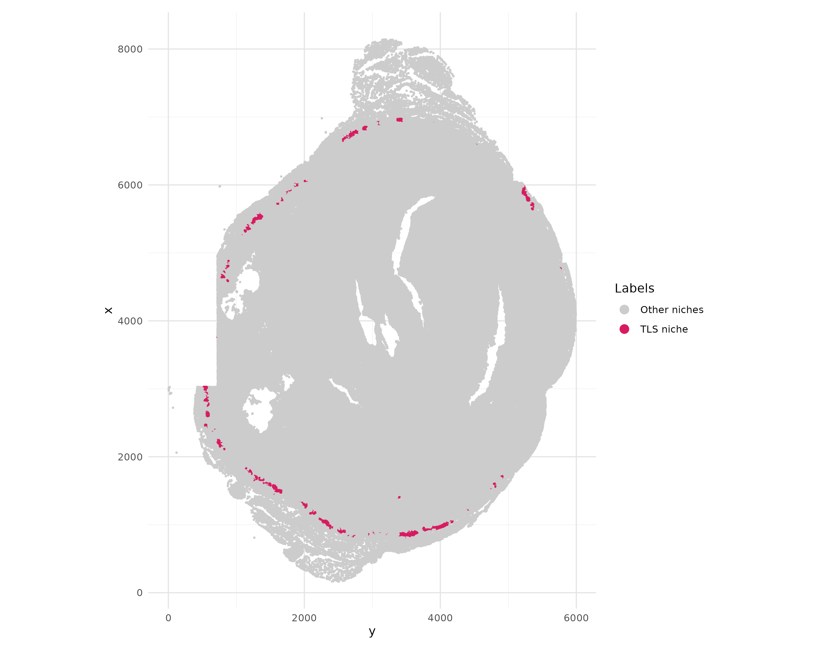
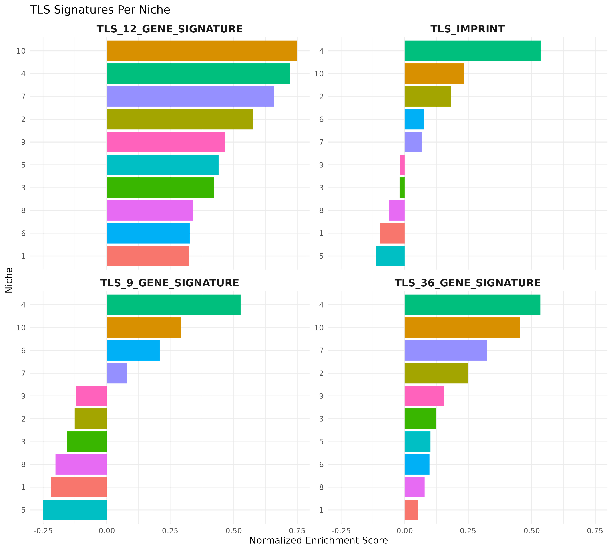

<p align="center">
  
</p>

<h1 align="center">TLSFindR</h1>

**TLSFindR** is an R package for identifying and characterizing B cell rich lymphoid structures, often called tertiary lymphoid structures (TLS) or tertiary lymphoid organs (organs) in spatial transcriptomic data using spatially-resolved cellular niches/neighborhoods. 
TLSFindR identifies these structures via user-defined proportions of B cells/B cell-dominant spots within these neighborhoods/niches and further confirms their identity via scoring for default or user-defined TLS gene signatures. 
This pipeline also features optimal neighborhood/niche number selection via a combined transcriptional coherence and cell type mixing score, as these TLSs/TLOs feature a combination of cell types with coherent biological/transcriptional programs. 
This approach eliminates the need for preliminary histological imaging and creates a distinct spatial entity that enables facile downstream analyses of these structures, such as differential gene expression, pathway analysis, and correlation with clinical outcomes data.

TLSFindR is compatible with spot-based spatial transcriptomic technologies, including Xenium and Visium. The package integrates:
- spatial neighborhood construction
- transcriptional coherence analysis and cell type mixing metrics
- gene signature scoring (ssGSEA/GSVA)

TLSFindR features built-in flexibility of user-defined features, including:
- adjustable neighborhood number and sizes
- parameters of TLS definitions
- default and user-defined gene signatures for TLS or other structures of interest

Key Features:
- Data-driven optimal neighborhood selection
- Balances transcriptional coherence and cell type mixing for TLS niche identification
- Based on B cell enrichment and composition
- Flexible visualization tools including heatmaps, spatial plots, enrichment plots
- Resulting data is appended to the spatial object metadata for facile downstream analyses and biological discovery

## Installation

You can install the development version of TLSFindR from [GitHub](https://github.com/) with:

``` r
# install.packages("pak")
pak::pak("schrankz/TLSFindR")
```

Dependencies:
- Seurat
- GSVA
- dplyr
- ggplot2
- Fnn


## Workflow Overview

A typical TLSFindR workflow includes:

1. Cell type annotation, if not already provided
2. Optimal neighborhood/niche number selection (k) (can also be user-defined) 
3. Spatial neighborhood/niche construction
4. Niche summarization and labeling by dominant and subdominant cell types within each niche
5. Appending of resulting analyses to object metadata
6. Signature scoring and visualization


## Example Workflow

``` r
library(TLSFindR)

# Load your spatial object
obj <- readRDS("your_object.rds")

# Step 1: Annotate cell types
obj <- run_annotation(obj, reference = "HumanPrimaryCellAtlasData", assay = "SCT")

# Step 2: Find optimal neighborhood/niche number
bestk <- find_optimal_k(obj, assay = "SCT", group_by = "SingleR_label")

# Step 3: Build neighborhoods/niches
obj <- niche_analysis(
  obj,
  optimal_k = bestk$optimal_k,
  num_neighbors = 30,
  group_by = "SingleR_label",
  fov = "slice1"
)

# Step 4: Summarize niches
niche_summary <- summarize_niches(
  obj,
  cell_label = "SingleR_label",
  niche_label = "niches",
  Bcell_label = "B_cell",
  B_cutoff = 0.1,
  max_subdominant = 1,
  structure_label = "TLS niche"
)

# Step 5: Add niche metadata to spatial object for downstream analyses
obj <- add_niche_metadata(obj, niche_summary)

# Step 6: Generate heatmap of cell proportions within each niche
heatmap <- plot_niche_heatmaps(obj, niche_slot = "niches",  label_slot = 'SingleR_label', normalize_by = "row", row_fontsize = 8, column_fontsize = 8)

# Step 7: Score niches using gene signatures and plot results
results <- run_niche_scoring(
  obj,
  signatures = human_tls_signatures,
  assay = "SCT"
)

results$plot
```

## Example Outputs

### Neighborhood/Niche Identification


### Niche Composition Heatmap



### Identified TLS Niche Image


### TLS Signature Scoring



## Bug Reports and Feature Requests:
Please open an issue:
https://github.com/schrankz/TLSFindR/issues


## License:
MIT License

